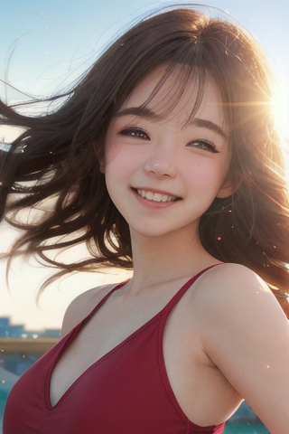

首先在自己pc的环境中，安装好相关的依赖，依次运行下列的代码。
加载safetensor进行推理：
```
python safetensor_infer.py \
    --input_path "./s/xxmix9realistic_v40.safetensors" \
    --output_path "./test_output" \
    --negative_prompt "easynegative,ng_deepnegative_v1_75t,(worst quality:2),(low quality:2),(normal quality:2),lowres,bad anatomy,bad hands,normal quality,((monochrome)),((grayscale)),((watermark))," \
    --prompt "1girl, upper body, (huge Laughing),sweety,sun glare, bokeh, depth of field, blurry background, light particles, strong wind,head tilt,simple background, red background,<lora:film:0.4>" 
```
推理结果：


导出onnx模型
```
python export_onnx.py --input_path ./s/xxmix9realistic_v40.safetensors --output_path ./out_onnx --isize 480x320 --prompt "1girl, upper body, (huge Laughing),sweety,sun glare, bokeh, depth of field, blurry background, light particles, strong wind,head tilt,simple background, red background,<lora:film:0.4>"
```

- 320x480 是横图，480x320 是竖图，也可以写 512x512，但是再大就会报错了，这里的尺寸要和后面vae等处的尺寸对应，有8倍的缩放
- prompt可以在模型的示例图中找一个，用来验证模型的原本的生成效果，但是由于固定了采样器类型，修改了分辨率等原因，所以可能和网页上有差距

运行完毕后会生成对应模型


注意：没有导出文本编码器模型，原因有2：1、ax给的导出demo环境有问题，导致一直导不出来 2、文本编码器都是用的clip，没有任何改动，所以也没必要导了


# onnx推理（可以跳过，只是验证onnx导出的准确性）
运行
```
python dpm_infer.py
```

注意修改代码中对应的提示词和路径等信息




# 准备矫正集
运行
```
python prepare_data.py
```
即可在目录下生成转换需要的矫正集，目录为calib_data_vae和calib_data_unet
注意，不同模型需要不同的样本，自行在代码中修改